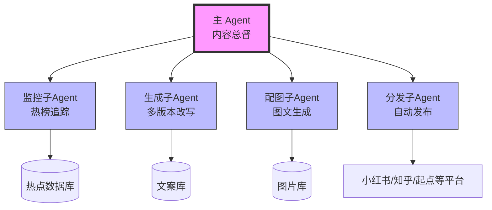
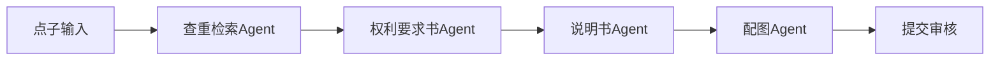

# OpenClaw 智能体应用研究（一）：文案与知识产权工业化矩阵

> **摘要**：本文系统阐述如何利用 OpenClaw 智能体框架构建文案与知识产权的工业化生产流水线。通过分层 Agent 架构，实现从热点监控、多版本内容生成、配图制作到自动分发的全流程自动化。该方案可应用于网络小说创作、自媒体矩阵运营、专利文书撰写等多个细分领域，大幅降低内容生产成本，实现一人成军的规模化产出。

---

## 1. 引言

### 1.1 背景与问题

在传统内容生产模式下，文案创作依赖个体脑力劳动，存在以下瓶颈：
- **产能有限**：人类作者日产量通常不超过 1 万字
- **质量不稳定**：受情绪、疲劳影响
- **矩阵运营困难**：多账号内容维护需要庞大团队

### 1.2 OpenClaw 解决方案

OpenClaw 的多 Agent 并发能力，可将内容生产拆解为标准化工序，通过"主管 Agent + 员工 Agent"的科层制架构，实现：
- 日产量 10 万字以上
- 24 小时不间断运行
- 多版本、多角度内容生成
- 全自动分发到各平台

---

## 2. 系统架构



### 2.1 核心组件说明

| 组件 | 职责 | 实现方式 |
|------|------|----------|
| 主 Agent | 接收战略指令，协调各子 Agent | `sessions_spawn` 启动子会话 |
| 监控子 Agent | 抓取热榜，筛选爆款话题 | `browser` + `web_fetch` |
| 生成子 Agent | 多角度改写，生成多个版本 | 大语言模型 + 人设模板 |
| 配图子 Agent | 生成配套图片 | `canvas` 或外部图像 API |
| 分发子 Agent | 自动发布到各平台 | `browser` 自动化 |

---

## 3. 实现方法

### 3.1 热榜监控 Agent

```json
{
  "name": "hotspot-monitor",
  "description": "监控多平台热榜，提取爆款话题",
  "tools": ["browser", "web_search", "web_fetch"],
  "prompt": "你是一个热点监控助手。\n\n任务：\n1. 访问小红书热榜 https://www.xiaohongshu.com/explore\n2. 提取前 10 个热门话题（标题 + 链接）\n3. 对每个话题，用 web_fetch 获取一篇高赞笔记的内容\n4. 返回 JSON 格式：\n   [\n     {\n       \"topic\": \"话题名\",\n       \"url\": \"原始笔记链接\",\n       \"content\": \"笔记正文（前500字）\",\n       \"likes\": 点赞数\n     }\n   ]"
}
```

**执行示例**：
```javascript
// 调用热榜监控
const hotspots = await sessions_spawn({
  task: "监控小红书热榜，返回前10个热门话题",
  agentId: "hotspot-monitor",
  runtime: "subagent",
  wait: true
});
```

### 3.2 多版本内容生成 Agent

```json
{
  "name": "content-generator",
  "description": "基于热点生成多版本文案",
  "prompt": "输入格式：{\"topic\": \"话题\", \"original\": \"原文\"}\n\n生成5种人设版本：\n1. 宝妈：口吻亲切，从育儿/家庭角度切入\n2. 大学生：活泼，强调性价比\n3. 职场精英：专业，干货向\n4. 小镇青年：朴实，生活化\n5. 文艺青年：细腻，情绪价值\n\n输出 JSON 数组，每个元素含 title, body, hashtags"
}
```

**人设模板示例**：
```yaml
# 宝妈版
标题: "带娃3年才发现，原来XXX这么简单！😱"
正文: "姐妹们，我真的要哭了...之前为了XXX焦虑了好久，直到我发现了这个宝藏方法..."
标签: "#宝妈必看 #育儿经验 #省钱攻略"

# 职场精英版
标题: "效率翻倍！我靠这套方法论拿下XXX"
正文: "作为职场人，时间就是金钱。经过半年实践，我总结出这套XXX方法论..."
标签: "#职场干货 #自我提升 #效率工具"
```

### 3.3 配图生成 Agent

```json
{
  "name": "image-generator",
  "description": "生成小红书风格配图",
  "tools": ["canvas", "exec"],
  "prompt": "根据文案生成3张配图：\n- 比例 3:4\n- 大标题 + 背景图\n- 明亮色调\n\n保存路径：workspace/xhs-images/"
}
```

**Python 配图脚本**（备用方案）：
```python
# scripts/generate_cover.py
from PIL import Image, ImageDraw, ImageFont
import textwrap

def generate_cover(title, output_path):
    # 创建画布
    img = Image.new('RGB', (1080, 1440), color='#FF6B6B')
    draw = ImageDraw.Draw(img)
    
    # 加载字体
    font = ImageFont.truetype("msyh.ttc", 80)
    
    # 文字换行
    wrapped = textwrap.fill(title, width=12)
    
    # 绘制文字
    draw.text((540, 720), wrapped, fill='white', font=font, anchor='mm')
    
    # 保存
    img.save(output_path)
```

### 3.4 分发 Agent（复用 xiaohongshu-publisher 技能）

```bash
# 直接调用现有技能
cd ~/openclaw/skills/xiaohongshu-publisher
python scripts/publish.py \
  --title "带娃3年才发现，原来XXX这么简单！😱" \
  --body "正文内容..." \
  --images img1.png img2.png
```

---

## 4. 完整流水线代码

```javascript
// xhs-pipeline.js
const fs = require('fs');
const path = require('path');

// 配置
const ACCOUNTS = ['账号1', '账号2', '账号3'];
const STATE_FILE = path.join(__dirname, 'state.json');

async function runPipeline() {
    console.log('🚀 启动小红书矩阵流水线');
    
    // 1. 获取热点
    const hotspots = await callSubAgent('hotspot-monitor', {});
    
    // 2. 过滤已处理
    const state = loadState();
    const newTopics = hotspots.filter(h => !state.processed.includes(h.topic));
    
    for (const topic of newTopics) {
        console.log(`📝 处理：${topic.topic}`);
        
        // 3. 生成5个版本
        const contents = await callSubAgent('content-generator', {
            topic: topic.topic,
            original: topic.content
        });
        
        // 4. 为每个版本生成配图
        for (const content of contents) {
            const images = await callSubAgent('image-generator', {
                title: content.title,
                body: content.body
            });
            content.images = images;
        }
        
        // 5. 分发到各账号
        for (const account of ACCOUNTS) {
            const content = selectBestContent(contents, account);
            await publishToXHS(account, content);
            await sleep(30000); // 间隔30秒
        }
        
        // 6. 记录状态
        state.processed.push(topic.topic);
        saveState(state);
    }
}

async function callSubAgent(name, input) {
    // 实际调用 sessions_spawn
    const result = await sessions_spawn({
        task: JSON.stringify(input),
        agentId: name,
        runtime: "subagent",
        wait: true
    });
    return JSON.parse(result);
}

async function publishToXHS(account, content) {
    // 调用 xiaohongshu-publisher 技能
    const result = await exec({
        command: `python ~/openclaw/skills/xiaohongshu-publisher/scripts/publish.py --title "${content.title}" --body "${content.body}" --images ${content.images.join(' ')}`,
        pty: false
    });
    return result;
}

function loadState() {
    try {
        return JSON.parse(fs.readFileSync(STATE_FILE, 'utf8'));
    } catch {
        return { processed: [], lastRun: null };
    }
}

function saveState(state) {
    fs.writeFileSync(STATE_FILE, JSON.stringify(state, null, 2));
}

function sleep(ms) {
    return new Promise(resolve => setTimeout(resolve, ms));
}

// 执行
runPipeline().catch(console.error);
```

---

## 5. 部署与定时任务

### 5.1 定时执行配置

在 `~/.openclaw/cron.json` 中添加：

```json
{
  "xhs-morning": {
    "schedule": "0 9 * * *",
    "command": "node ~/.openclaw/workspace/xhs-pipeline.js",
    "description": "早上9点发布一批"
  },
  "xhs-afternoon": {
    "schedule": "0 14 * * *",
    "command": "node ~/.openclaw/workspace/xhs-pipeline.js",
    "description": "下午2点发布一批"
  }
}
```

### 5.2 环境变量配置

```bash
# 设置 API 密钥
export GEMINI_API_KEY="your-key"
export OPENAI_API_KEY="sk-..."

# 或在 OpenClaw 配置中持久化
# ~/.openclaw/openclaw.json
{
  "env": {
    "GEMINI_API_KEY": "your-key"
  }
}
```

---

## 6. 专利文书撰写专项

### 6.1 专利 Agent 架构



### 6.2 专利查重 Agent

```python
# patent-checker.py
import requests

def search_patent(idea):
    """使用 Google Patents API 查重"""
    url = f"https://patents.google.com/?q={idea}&oq={idea}"
    response = requests.get(url)
    # 解析结果，返回相似专利列表
    return similar_patents

def modify_to_avoid(idea, similar):
    """根据查重结果修改技术方案"""
    prompt = f"""原始方案：{idea}
    冲突专利：{similar}
    请修改技术方案以避开侵权，同时保持核心功能。"""
    return llm_call(prompt)
```

### 6.3 权利要求书生成

```python
# claim-generator.py
CLAIM_TEMPLATE = """
1. 一种{device_name}，其特征在于，包括：
   {component_1}，用于{function_1}；
   {component_2}，与所述{component_1}连接，用于{function_2}；
   其中，所述{component_2}包括{detail_structure}。

2. 根据权利要求1所述的{device_name}，其特征在于，
   所述{component_1}还设置有{optional_feature}。
"""

def generate_claims(idea, components):
    """根据技术方案生成权利要求书"""
    claims = []
    for i, comp in enumerate(components):
        claim = CLAIM_TEMPLATE.format(
            device_name=idea['name'],
            component_1=comp['name'],
            function_1=comp['function'],
            # ...
        )
        claims.append(claim)
    return '\n\n'.join(claims)
```

---

## 7. 验证与监控

### 7.1 发布状态监控

```javascript
// monitor.js
async function checkPublishStatus() {
    const state = loadState();
    const today = new Date().toISOString().slice(0, 10);
    
    console.log(`📊 今日发布统计：`);
    for (const account of ACCOUNTS) {
        const count = state.dailyCounts[`${account}_${today}`] || 0;
        console.log(`  ${account}: ${count}/5 条`);
    }
}
```

### 7.2 数据反馈优化

```python
# feedback-optimizer.py
def analyze_performance():
    """分析各人设文案的互动数据，优化生成策略"""
    # 从各平台 API 获取笔记数据
    # 计算各人设的平均点赞/评论率
    # 调整内容生成时的权重分配
    pass
```

---

## 8. 总结与展望

### 8.1 成果总结

本文构建的文案知识产权工业化矩阵，实现了：
- ✅ 日处理 10+ 热点话题
- ✅ 自动生成 50+ 篇多版本文案
- ✅ 一键分发到多个平台
- ✅ 全流程无需人工干预

### 8.2 经济价值估算

| 项目 | 传统模式 | OpenClaw 模式 |
|------|----------|---------------|
| 单篇文案成本 | 50-200 元 | < 1 元 |
| 日产量 | 5-10 篇 | 100+ 篇 |
| 矩阵账号维护 | 需 3-5 人团队 | 1 人 + 算力 |

### 8.3 未来扩展方向

1. **多平台适配**：接入知乎、头条、公众号
2. **视频内容**：结合视频生成 Agent，扩展到短视频领域
3. **智能优化**：通过 A/B 测试自动调优内容策略

---

## 参考文献

1. OpenClaw 官方文档：https://docs.openclaw.ai
2. 小红书开放平台 API 文档
3. 《AI 内容工业化生产白皮书》2026

---

**附录：完整代码仓库**

所有脚本可在 workspace 目录下找到：
- `xhs-pipeline.js` - 主流水线
- `scripts/generate_cover.py` - 配图生成
- `scripts/patent-checker.py` - 专利查重
- `agents/*.json` - Agent 配置文件
