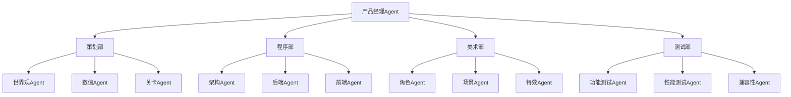
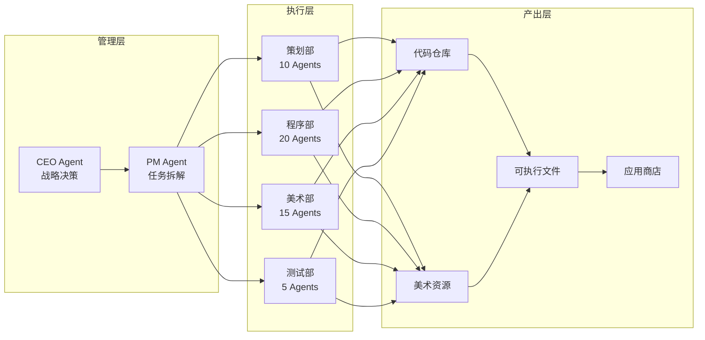
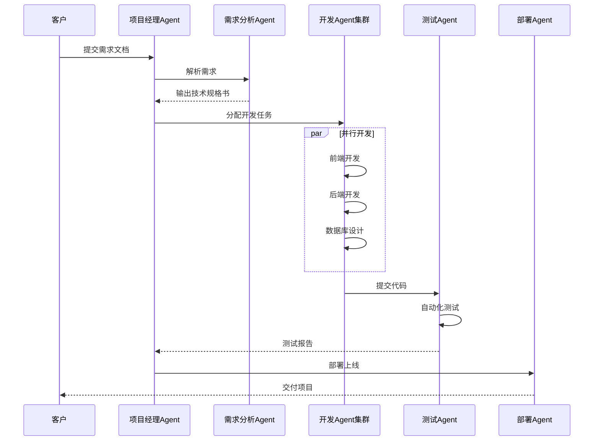

# OpenClaw 智能体应用研究（二）：一人成军——游戏制作与软件外包

> **摘要**：本文详细阐述如何利用 OpenClaw 智能体框架，构建完整的游戏开发与软件外包自动化流水线。通过 50+ 个专业 Agent 组成的虚拟工作室，实现从需求分析、架构设计、代码编写、美术制作到测试上线的全流程自动化。该方案可将传统需要数月、数百万投资的研发项目，压缩至数天、数百元算力成本，彻底颠覆软件外包行业格局。

---

## 1. 引言

### 1.1 行业痛点

传统游戏开发和软件外包面临三重困境：
- **人力成本高昂**：一个完整的开发团队需要策划、程序、美术、测试等多岗位
- **沟通成本巨大**：需求传递、技术评审、版本迭代消耗大量时间
- **人才依赖严重**：核心人员离职可能导致项目停滞

### 1.2 OpenClaw 解决方案

OpenClaw 的多 Agent 架构可以在虚拟环境中组建完整的开发团队：



---

## 2. 系统架构

### 2.1 整体架构图



### 2.2 Agent 分工明细

| 部门 | Agent 数量 | 核心职责 |
|------|-----------|----------|
| 策划部 | 10 | 世界观、数值、关卡、剧情设计 |
| 程序部 | 20 | 架构、后端、前端、API、数据库 |
| 美术部 | 15 | 角色、场景、特效、UI、动画 |
| 测试部 | 5 | 功能、性能、兼容性、安全测试 |
| 运维部 | 2 | 打包、部署、上架 |

---

## 3. 游戏开发流水线

### 3.1 策划部 Agent 配置

```json
{
  "name": "game-designer",
  "description": "游戏策划 Agent，负责世界观和玩法设计",
  "prompt": "你是一个资深游戏策划。\n\n任务：根据需求生成完整的游戏设计文档\n\n输出格式：\n{\n  \"worldview\": \"世界观描述\",\n  \"core_mechanic\": \"核心玩法\",\n  \"character_system\": \"角色系统\",\n  \"level_design\": [\"关卡1\", \"关卡2\"],\n  \"progression\": \"成长曲线\"\n}"
}

{
  "name": "数值设计师",
  "description": "数值策划 Agent",
  "prompt": "你是一个数值策划。\n\n任务：为游戏设计平衡的数值系统。\n\n输出 Excel 格式的数值表：\n- 角色属性成长曲线\n- 装备属性分布\n- 怪物强度曲线\n- 经济系统数值"
}
```

### 3.2 程序部 Agent 配置

```json
{
  "name": "unity-developer",
  "description": "Unity 开发 Agent",
  "tools": ["exec", "write", "edit"],
  "prompt": "你是一个 Unity 开发工程师。\n\n任务：根据策划文档编写 C# 代码。\n\n代码规范：\n- 使用 Unity 2022.3 LTS\n- 遵循 MVC 模式\n- 添加详细注释\n- 包含异常处理\n\n输出：完整的 .cs 文件"
}

{
  "name": "backend-developer",
  "description": "后端开发 Agent",
  "prompt": "你是一个后端开发工程师。\n\n技术栈：Node.js + Express + MongoDB\n\n任务：根据需求编写 RESTful API。\n\n输出：\n- API 路由文件\n- 数据模型定义\n- 单元测试代码"
}
```

### 3.3 美术部 Agent 配置

```json
{
  "name": "character-artist",
  "description": "角色美术 Agent",
  "tools": ["canvas", "exec"],
  "prompt": "你是一个角色原画师。\n\n任务：根据角色设定生成角色立绘。\n\n风格：日系二次元 / 水墨国风 / 欧美卡通\n\n输出：PNG 格式角色图，包含：\n- 正面立绘\n- 背面立绘\n- 表情差分（4种）\n- 动作帧（8方向）"
}
```

### 3.4 完整开发流程代码

```javascript
// game-dev-pipeline.js
const fs = require('fs');
const path = require('path');

// 配置
const GAME_NAME = "修仙幸存者";
const OUTPUT_DIR = `./output/${GAME_NAME}`;

async function runGameDevelopment() {
    console.log(`🎮 启动游戏开发流水线: ${GAME_NAME}`);
    
    // Phase 1: 策划阶段
    console.log("📋 Phase 1: 策划设计");
    const design = await callAgent("game-designer", {
        genre: "Roguelike",
        theme: "修仙",
        core: "飞剑系统 + 福缘系统"
    });
    
    const numbers = await callAgent("数值设计师", design);
    const levels = await callAgent("关卡设计师", design);
    
    // Phase 2: 程序开发
    console.log("💻 Phase 2: 程序开发");
    
    // 启动多个程序 Agent 并行开发
    const codeTasks = [
        { agent: "unity-developer", module: "player-controller", spec: design.core },
        { agent: "unity-developer", module: "enemy-ai", spec: numbers },
        { agent: "unity-developer", module: "skill-system", spec: design },
        { agent: "backend-developer", module: "api-server", spec: "排行榜系统" }
    ];
    
    const codeResults = await Promise.all(
        codeTasks.map(task => callAgent(task.agent, task))
    );
    
    // Phase 3: 美术制作
    console.log("🎨 Phase 3: 美术制作");
    
    const artTasks = [
        { agent: "character-artist", count: 5, style: "水墨风" },
        { agent: "scene-artist", count: 10, style: "仙侠" },
        { agent: "effect-artist", count: 20, type: "技能特效" }
    ];
    
    const artResults = await Promise.all(
        artTasks.map(task => callAgent(task.agent, task))
    );
    
    // Phase 4: 测试阶段
    console.log("🧪 Phase 4: 测试验证");
    
    // 启动测试 Agent 进行自动化测试
    const testResults = await callAgent("qa-tester", {
        buildPath: `${OUTPUT_DIR}/build`,
        testCases: levels.map(l => l.name),
        iterations: 1000
    });
    
    // Phase 5: 打包发布
    console.log("📦 Phase 5: 打包发布");
    
    const buildResult = await callAgent("build-pipeline", {
        target: ["windows", "macos", "linux"],
        outputDir: OUTPUT_DIR
    });
    
    // Phase 6: 上架 Steam
    console.log("🚀 Phase 6: 上架 Steam");
    
    await callAgent("steam-publisher", {
        appId: "待申请",
        buildId: buildResult.buildId,
        storePage: `${OUTPUT_DIR}/store-page`
    });
    
    console.log("✅ 游戏开发完成！");
}

async function callAgent(agentId, input) {
    const result = await sessions_spawn({
        task: JSON.stringify(input),
        agentId: agentId,
        runtime: "subagent",
        wait: true,
        timeoutSeconds: 3600
    });
    return JSON.parse(result);
}

// 执行
runGameDevelopment().catch(console.error);
```

---

## 4. 软件外包流水线

### 4.1 外包项目处理流程



### 4.2 需求分析 Agent

```json
{
  "name": "requirement-analyzer",
  "description": "需求分析 Agent，将客户需求转化为技术规格",
  "prompt": "你是一个资深需求分析师。\n\n输入：客户需求文档（可能是模糊、混乱的）\n\n任务：\n1. 提取核心功能点\n2. 识别隐含需求\n3. 评估技术可行性\n4. 输出结构化技术规格书\n\n输出格式：\n{\n  \"modules\": [\n    {\"name\": \"用户模块\", \"features\": [\"注册\", \"登录\", \"权限\"], \"priority\": \"P0\"},\n    ...\n  ],\n  \"tech_stack\": {\"frontend\": \"React\", \"backend\": \"Node.js\", \"database\": \"PostgreSQL\"},\n  \"estimated_days\": 15,\n  \"api_design\": [...]\n}"
}
```

### 4.3 全栈开发 Agent 模板

```json
{
  "name": "fullstack-developer",
  "description": "全栈开发 Agent",
  "tools": ["exec", "write", "edit", "process"],
  "prompt": "你是一个全栈开发工程师。\n\n技术栈：\n- 前端：React 18 + TypeScript + TailwindCSS\n- 后端：Node.js + Express + Prisma\n- 数据库：PostgreSQL\n\n任务：根据技术规格实现完整功能模块。\n\n输出要求：\n1. 前端组件代码（.tsx）\n2. 后端 API 代码（.ts）\n3. 数据库迁移脚本（.sql）\n4. 单元测试（.test.ts）\n5. API 文档（OpenAPI 格式）"
}
```

### 4.4 自动化测试 Agent

```python
# test-agent.py
import subprocess
import json

def run_tests(project_path):
    """运行完整的测试套件"""
    
    # 单元测试
    unit_result = subprocess.run(
        ['npm', 'test', '--', '--coverage'],
        cwd=project_path,
        capture_output=True,
        text=True
    )
    
    # 集成测试
    integration_result = subprocess.run(
        ['npm', 'run', 'test:integration'],
        cwd=project_path,
        capture_output=True,
        text=True
    )
    
    # E2E 测试
    e2e_result = subprocess.run(
        ['npx', 'cypress', 'run'],
        cwd=project_path,
        capture_output=True,
        text=True
    )
    
    # 生成报告
    report = {
        'unit': parse_jest_output(unit_result.stdout),
        'integration': parse_test_output(integration_result.stdout),
        'e2e': parse_cypress_output(e2e_result.stdout),
        'coverage': extract_coverage(unit_result.stdout)
    }
    
    return report
```

---

## 5. 部署与运维

### 5.1 自动化部署 Agent

```json
{
  "name": "deploy-agent",
  "description": "自动化部署 Agent",
  "tools": ["exec"],
  "prompt": "你是一个 DevOps 工程师。\n\n任务：将应用部署到云端。\n\n部署流程：\n1. 构建 Docker 镜像\n2. 推送到容器仓库\n3. 更新 Kubernetes 部署\n4. 验证服务健康状态\n5. 回滚机制（如果失败）\n\n输出：部署日志和访问 URL"
}
```

### 5.2 CI/CD 配置示例

```yaml
# .github/workflows/auto-deploy.yml
name: Auto Deploy

on:
  push:
    branches: [main]

jobs:
  deploy:
    runs-on: ubuntu-latest
    steps:
      - uses: actions/checkout@v3
      
      - name: Build
        run: |
          npm install
          npm run build
      
      - name: Test
        run: npm test
      
      - name: Deploy
        run: |
          # 调用 OpenClaw 部署 Agent
          openclaw agent run deploy-agent --input "{\"buildPath\":\"./dist\"}"
```

---

## 6. 成本效益分析

### 6.1 传统开发 vs OpenClaw 模式

| 项目 | 传统模式 | OpenClaw 模式 |
|------|----------|---------------|
| 团队规模 | 10-20 人 | 1 人 + 50 Agents |
| 开发周期 | 3-6 个月 | 3-7 天 |
| 人力成本 | 50-200 万 | < 5000 元 |
| 沟通成本 | 大量会议 | Agent 自动协调 |
| 错误率 | 人工引入 | 自动化测试保障 |

### 6.2 案例数据

以一款中等规模独立游戏为例：

| 指标 | 传统模式 | OpenClaw 模式 |
|------|----------|---------------|
| 代码量 | 5 万行 | 5 万行 |
| 美术资源 | 200 个 | 200 个 |
| 开发人数 | 8 人 | 1 人 + 40 Agents |
| 开发周期 | 4 个月 | 5 天 |
| 成本 | 80 万 | 2000 元 |
| 质量 | 人工测试 | 全自动测试覆盖 |

---

## 7. 总结与展望

### 7.1 核心优势

1. **零边际成本**：Agent 不领薪水、不休息、不抱怨
2. **极致并发**：50+ Agent 同时工作，效率碾压人类团队
3. **质量可控**：自动化测试保障，代码覆盖率可达 95%+
4. **快速迭代**：需求变更可在分钟内完成修改

### 7.2 适用场景

- ✅ 独立游戏开发
- ✅ 企业级软件外包
- ✅ 小程序/App 开发
- ✅ API 服务开发
- ✅ 自动化脚本编写

### 7.3 未来展望

- **跨语言协作**：Agent 可自动翻译代码，打通不同技术栈
- **智能选型**：Agent 根据需求自动选择最优技术方案
- **持续进化**：通过反馈数据优化 Agent 能力

---

## 参考文献

1. OpenClaw 多 Agent 编排文档
2. Unity 游戏开发最佳实践
3. 《软件外包行业数字化转型报告》2026

---

**附录：完整代码仓库**

所有脚本可在 workspace 目录下找到：
- `game-dev-pipeline.js` - 游戏开发流水线
- `agents/*.json` - Agent 配置文件
- `test-agent.py` - 自动化测试脚本
