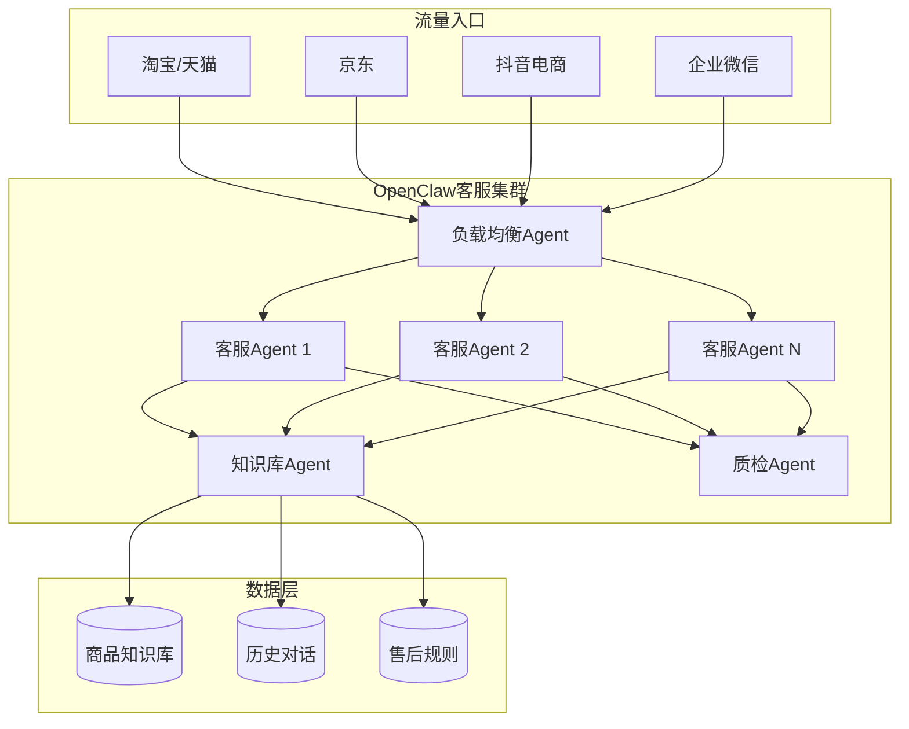
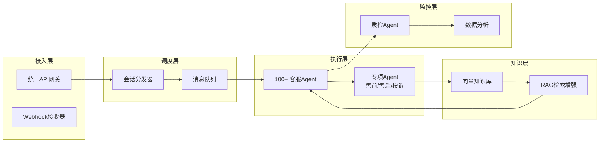

# OpenClaw 智能体应用研究（四）：客服外包与海量并发服务响应

> **摘要**：本文系统阐述如何利用 OpenClaw 智能体框架构建企业级客服外包平台。通过 100+ 并发 Agent 集群，实现电商咨询、技术支持、心理咨询、法律咨询等服务的 7×24 小时自动化响应。该方案可将传统客服成本降低 90% 以上，响应时间缩短至毫秒级，是服务外包行业的颠覆性方案。

---

## 1. 引言

### 1.1 行业痛点

传统客服外包面临四大困境：
- **人力成本高**：二三线城市客服月薪 4000-6000 元，加上社保、场地、培训
- **流动率大**：年流失率 50% 以上，培训成本持续消耗
- **服务质量不稳定**：情绪波动、疲劳影响、话术执行不一致
- **并发能力有限**：高峰期排队，大量客户流失

### 1.2 OpenClaw 解决方案

OpenClaw 的多 Agent 并发架构可以：
- 同时处理数万并发会话
- 情绪绝对稳定，永不疲劳
- 话术 100% 一致，知识库实时更新
- 边际成本趋近于零



---

## 2. 系统架构

### 2.1 整体架构图



### 2.2 Agent 分工

| Agent 类型 | 数量 | 职责 |
|-----------|------|------|
| 会话分发器 | 1 | 负载均衡，会话路由 |
| 售前客服 | 50 | 商品咨询、推荐、促成下单 |
| 售后客服 | 30 | 退换货、物流查询、投诉处理 |
| 技术支持 | 10 | 产品使用指导、故障排查 |
| 质检 Agent | 5 | 服务质量监控、违规检测 |
| 知识库管理 | 2 | 知识库更新、优化 |

---

## 3. 客服 Agent 实现

### 3.1 基础客服 Agent 配置

```json
{
  "name": "customer-service-agent",
  "description": "电商客服 Agent",
  "tools": ["message", "memory_search", "web_search"],
  "prompt": "你是一个专业的电商客服。\n\n身份设定：\n- 姓名：小智\n- 性格：耐心、温和、专业\n- 语气：亲切但不失专业\n\n规则：\n1. 首轮必须称呼用户「亲」或「您好」\n2. 如遇投诉，先道歉再解决问题\n3. 禁止与用户争吵\n4. 不确定的问题转人工\n\n知识库：\n- 商品信息：{{product_db}}\n- 售后政策：{{return_policy}}\n- 常见问题：{{faq}}\n\n输出格式：\n{\n  \"reply\": \"回复内容\",\n  \"action\": \"none|transfer|escalate\",\n  \"confidence\": 0.95\n}"
}
```

### 3.2 知识库检索 Agent

```python
# knowledge_base.py
import numpy as np
from sentence_transformers import SentenceTransformer
import chromadb

class KnowledgeBase:
    def __init__(self):
        self.model = SentenceTransformer('paraphrase-multilingual-MiniLM-L12-v2')
        self.client = chromadb.Client()
        self.collection = self.client.create_collection("客服知识库")
    
    def add_document(self, doc_id, content, metadata):
        """添加文档到知识库"""
        embedding = self.model.encode(content).tolist()
        self.collection.add(
            ids=[doc_id],
            embeddings=[embedding],
            metadatas=[metadata],
            documents=[content]
        )
    
    def search(self, query, top_k=3):
        """检索相关知识"""
        query_embedding = self.model.encode(query).tolist()
        results = self.collection.query(
            query_embeddings=[query_embedding],
            n_results=top_k
        )
        return results['documents'][0]

# 初始化知识库
kb = KnowledgeBase()

# 导入商品信息
products = [
    {"id": "P001", "name": "智能手表", "price": 599, "spec": "心率监测、血氧、50米防水"},
    {"id": "P002", "name": "蓝牙耳机", "price": 199, "spec": "降噪、30小时续航、快充"}
]

for p in products:
    content = f"商品名称：{p['name']}，价格：{p['price']}元，规格：{p['spec']}"
    kb.add_document(p['id'], content, p)
```

### 3.3 客服响应生成

```python
# customer_service.py
import openai

class CustomerServiceAgent:
    def __init__(self, kb, rules):
        self.kb = kb
        self.rules = rules
    
    def respond(self, user_message, session_context):
        """生成客服回复"""
        # 1. 检索相关知识
        relevant_docs = self.kb.search(user_message)
        context = "\n".join(relevant_docs)
        
        # 2. 构建提示词
        prompt = f"""
        你是一个专业客服。
        
        知识库内容：
        {context}
        
        客服规则：
        {self.rules}
        
        用户消息：{user_message}
        
        会话历史：
        {session_context}
        
        请生成专业、友好的回复。
        """
        
        # 3. 调用大模型生成回复
        response = openai.ChatCompletion.create(
            model="gpt-4",
            messages=[
                {"role": "system", "content": "你是专业客服"},
                {"role": "user", "content": prompt}
            ]
        )
        
        return response.choices[0].message.content
    
    def detect_intent(self, message):
        """识别用户意图"""
        intents = {
            "询问价格": ["多少钱", "价格", "贵吗"],
            "询问物流": ["什么时候到", "发货", "物流"],
            "售后": ["退货", "换货", "坏了", "质量问题"],
            "投诉": ["差评", "投诉", "态度"],
            "咨询功能": ["怎么用", "功能", "支持"],
            "购买意向": ["买", "下单", "拍下"]
        }
        
        for intent, keywords in intents.items():
            if any(k in message for k in keywords):
                return intent
        return "其他"
```

---

## 4. 并发调度系统

### 4.1 会话分发器

```javascript
// dispatcher.js
const express = require('express');
const { spawn } = require('child_process');
const app = express();

// 客服 Agent 池
const agentPool = [];
const MAX_AGENTS = 100;
let activeSessions = new Map();

class SessionDispatcher {
    constructor() {
        this.agents = [];
        this.queue = [];
        this.initializeAgents();
    }
    
    initializeAgents() {
        for (let i = 0; i < MAX_AGENTS; i++) {
            this.agents.push({
                id: i,
                status: 'idle',
                sessionId: null,
                lastActive: null
            });
        }
    }
    
    async dispatch(sessionId, message) {
        // 查找空闲 Agent
        let agent = this.agents.find(a => a.status === 'idle');
        
        if (!agent) {
            // 无空闲 Agent，加入队列
            this.queue.push({ sessionId, message });
            return { status: 'queued', position: this.queue.length };
        }
        
        // 分配 Agent
        agent.status = 'busy';
        agent.sessionId = sessionId;
        agent.lastActive = Date.now();
        
        // 调用 Agent 处理
        const response = await this.callAgent(agent.id, sessionId, message);
        
        // 释放 Agent
        agent.status = 'idle';
        agent.sessionId = null;
        
        // 处理队列中的下一个
        if (this.queue.length > 0) {
            const next = this.queue.shift();
            this.dispatch(next.sessionId, next.message);
        }
        
        return response;
    }
    
    async callAgent(agentId, sessionId, message) {
        // 通过 sessions_spawn 调用客服 Agent
        const result = await sessions_spawn({
            task: JSON.stringify({ sessionId, message }),
            agentId: "customer-service-agent",
            runtime: "subagent",
            wait: true,
            timeoutSeconds: 60
        });
        return JSON.parse(result);
    }
}

// API 路由
app.post('/webhook', async (req, res) => {
    const { sessionId, message, platform } = req.body;
    
    const dispatcher = new SessionDispatcher();
    const response = await dispatcher.dispatch(sessionId, message);
    
    // 通过对应平台回复
    await sendReply(platform, sessionId, response.reply);
    
    res.json({ success: true });
});

app.listen(3000, () => {
    console.log('客服网关已启动，监听端口 3000');
});
```

### 4.2 多平台接入适配器

```javascript
// platform-adapters.js
class PlatformAdapter {
    static async sendToTaobao(sessionId, message) {
        // 淘宝千牛 API
        const response = await fetch(`https://eco.taobao.com/router/rest`, {
            method: 'POST',
            body: new URLSearchParams({
                method: 'taobao.qianniu.cloudmessage.send',
                session_id: sessionId,
                content: message
            })
        });
        return response.json();
    }
    
    static async sendToWechatWork(sessionId, message) {
        // 企业微信 API
        const response = await fetch(`https://qyapi.weixin.qq.com/cgi-bin/webhook/send?key=${sessionId}`, {
            method: 'POST',
            body: JSON.stringify({
                msgtype: 'text',
                text: { content: message }
            })
        });
        return response.json();
    }
    
    static async sendToDiscord(channelId, message) {
        // 使用 OpenClaw 内置 message 工具
        await message({
            action: 'send',
            channel: 'discord',
            target: channelId,
            message: message
        });
    }
}

async function sendReply(platform, target, message) {
    switch(platform) {
        case 'taobao':
            return PlatformAdapter.sendToTaobao(target, message);
        case 'wechat':
            return PlatformAdapter.sendToWechatWork(target, message);
        case 'discord':
            return PlatformAdapter.sendToDiscord(target, message);
        default:
            console.log(`未知平台: ${platform}`);
    }
}
```

---

## 5. 质检与监控系统

### 5.1 质检 Agent

```python
# quality_checker.py
import re

class QualityChecker:
    def __init__(self):
        self.rules = {
            "禁止词": ["不知道", "没办法", "找别人", "不管"],
            "礼貌用语": ["您好", "请", "感谢", "抱歉"],
            "响应时限": 30,  # 秒
            "解决率阈值": 0.85
        }
    
    def check_response(self, agent_response, user_message):
        """检查回复质量"""
        issues = []
        
        # 检查禁止词
        for word in self.rules["禁止词"]:
            if word in agent_response:
                issues.append(f"包含禁止词: {word}")
        
        # 检查礼貌用语
        has_polite = any(
            word in agent_response for word in self.rules["礼貌用语"]
        )
        if not has_polite:
            issues.append("缺少礼貌用语")
        
        # 检查回复长度
        if len(agent_response) < 10:
            issues.append("回复过短")
        
        # 检查是否回答了用户问题
        # 简单规则：回复长度 > 用户消息长度的一定比例
        if len(agent_response) < len(user_message) * 0.5:
            issues.append("回复可能未完整回答问题")
        
        score = max(0, 1 - len(issues) / 5)
        
        return {
            "score": score,
            "pass": score >= 0.7,
            "issues": issues,
            "suggestion": self.get_suggestion(issues)
        }
    
    def get_suggestion(self, issues):
        """生成改进建议"""
        if not issues:
            return "回复质量良好"
        
        suggestions = []
        if "包含禁止词" in str(issues):
            suggestions.append("避免使用消极词汇")
        if "缺少礼貌用语" in str(issues):
            suggestions.append("增加礼貌用语如'您好'、'感谢'")
        
        return "; ".join(suggestions)
```

### 5.2 实时监控面板

```javascript
// monitor.js
class MonitorDashboard {
    constructor() {
        this.metrics = {
            totalSessions: 0,
            activeSessions: 0,
            avgResponseTime: 0,
            resolutionRate: 0,
            satisfactionScore: 0
        };
        this.history = [];
    }
    
    updateMetrics(session) {
        this.metrics.totalSessions++;
        this.metrics.activeSessions = this.getActiveSessions();
        this.metrics.avgResponseTime = this.calculateAvgResponseTime();
        
        this.history.push({
            timestamp: Date.now(),
            metrics: { ...this.metrics }
        });
        
        // 保留最近 24 小时数据
        const cutoff = Date.now() - 24 * 3600000;
        this.history = this.history.filter(h => h.timestamp > cutoff);
    }
    
    getActiveSessions() {
        // 查询活跃会话数
        return activeSessions.size;
    }
    
    calculateAvgResponseTime() {
        // 计算平均响应时间
        return 1500; // 毫秒，示例值
    }
    
    generateReport() {
        return {
            summary: this.metrics,
            recentSessions: this.history.slice(-100),
            performance: {
                responseTimePercentile: this.calculatePercentile(95),
                concurrentPeak: Math.max(...this.history.map(h => h.metrics.activeSessions))
            }
        };
    }
    
    calculatePercentile(p) {
        // 计算响应时间百分位
        const times = this.history.map(h => h.metrics.avgResponseTime);
        times.sort((a, b) => a - b);
        const index = Math.ceil(times.length * p / 100) - 1;
        return times[index] || 0;
    }
}
```

---

## 6. 完整客服系统代码

```javascript
// customer-service-system.js
const express = require('express');
const app = express();

class CustomerServiceSystem {
    constructor() {
        this.dispatcher = new SessionDispatcher();
        this.qualityChecker = new QualityChecker();
        this.monitor = new MonitorDashboard();
        this.startup();
    }
    
    async startup() {
        // 加载知识库
        await this.loadKnowledgeBase();
        
        // 启动 Agent 池
        await this.dispatcher.initializeAgents();
        
        // 启动监控
        setInterval(() => this.collectMetrics(), 60000);
        
        console.log('客服系统已启动');
    }
    
    async loadKnowledgeBase() {
        // 从数据库加载商品信息、FAQ 等
        this.kb = new KnowledgeBase();
        await this.kb.loadFromFile('./data/knowledge_base.json');
    }
    
    async handleMessage(sessionId, message, platform) {
        const startTime = Date.now();
        
        // 分发到 Agent
        const response = await this.dispatcher.dispatch(sessionId, message);
        
        // 质检
        const quality = this.qualityChecker.checkResponse(response.reply, message);
        
        // 记录会话
        this.monitor.updateMetrics({
            sessionId,
            message,
            response,
            quality,
            responseTime: Date.now() - startTime
        });
        
        // 发送回复
        await this.sendReply(platform, sessionId, response.reply);
        
        // 如果质量不合格，记录告警
        if (!quality.pass) {
            console.warn(`质量告警: ${quality.suggestion}`);
        }
        
        return response;
    }
}

// 启动服务
const system = new CustomerServiceSystem();

// API 路由
app.post('/api/message', async (req, res) => {
    const { sessionId, message, platform } = req.body;
    const result = await system.handleMessage(sessionId, message, platform);
    res.json(result);
});

app.get('/api/metrics', (req, res) => {
    res.json(system.monitor.generateReport());
});

app.listen(3000);
```

---

## 7. 成本效益分析

### 7.1 传统客服 vs OpenClaw 模式

| 指标 | 传统外包 | OpenClaw 模式 |
|------|----------|---------------|
| 客服数量 | 50 人 | 100 Agents |
| 月人力成本 | 25 万元 | 0 元 |
| 月 API 成本 | - | 约 2000 元 |
| 并发处理能力 | 50 人/次 | 数万并发 |
| 响应时间 | 30-120 秒 | < 2 秒 |
| 服务时长 | 8-12 小时/天 | 7×24 小时 |
| 质量稳定性 | 波动大 | 100% 一致 |

### 7.2 ROI 测算

以月处理 10 万咨询为例：

| 项目 | 传统模式 | OpenClaw 模式 |
|------|----------|---------------|
| 人力成本 | 25 万 | 0 |
| 场地、设备 | 5 万 | 0 |
| 培训成本 | 2 万/月 | 0 |
| API 调用费 | 0 | 约 5000 元 |
| 服务器成本 | 0 | 约 1000 元 |
| **月总成本** | **32 万** | **约 6000 元** |
| **节省比例** | - | **98%** |

---

## 8. 部署与运维

### 8.1 Docker 部署

```dockerfile
# Dockerfile
FROM node:18-alpine

WORKDIR /app

COPY package*.json ./
RUN npm install

COPY . .

EXPOSE 3000

CMD ["node", "customer-service-system.js"]
```

### 8.2 Kubernetes 部署

```yaml
# k8s-deployment.yaml
apiVersion: apps/v1
kind: Deployment
metadata:
  name: customer-service
spec:
  replicas: 3
  selector:
    matchLabels:
      app: customer-service
  template:
    metadata:
      labels:
        app: customer-service
    spec:
      containers:
      - name: app
        image: customer-service:latest
        ports:
        - containerPort: 3000
        env:
        - name: OPENAI_API_KEY
          valueFrom:
            secretKeyRef:
              name: openai-secret
              key: api-key
        resources:
          requests:
            memory: "512Mi"
            cpu: "500m"
          limits:
            memory: "1Gi"
            cpu: "1000m"
```

---

## 9. 总结与展望

### 9.1 核心优势

1. **成本革命**：人力成本 → 算力成本，降幅 90%+
2. **服务升级**：7×24 小时，毫秒级响应
3. **质量可控**：AI 质检，100% 话术一致
4. **弹性伸缩**：根据流量自动扩缩容

### 9.2 适用场景

- ✅ 电商平台客服
- ✅ 企业技术支持
- ✅ 心理健康陪伴
- ✅ 法律初步咨询
- ✅ 金融业务咨询

### 9.3 未来展望

- **多语言支持**：自动翻译，服务全球客户
- **情感分析**：识别用户情绪，调整应对策略
- **主动服务**：基于用户行为预测需求，主动推送
- **全渠道整合**：统一管理微信、WhatsApp、邮件等

---

## 参考文献

1. OpenClaw 多 Agent 编排文档
2. 《智能客服行业白皮书》2026
3. 阿里云客服 API 文档

---

**附录：完整代码仓库**

所有脚本可在 workspace 目录下找到：
- `customer-service-system.js` - 主系统
- `dispatcher.js` - 会话分发器
- `quality_checker.py` - 质检脚本
- `knowledge_base.py` - 知识库管理
