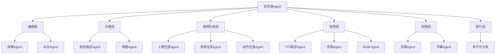
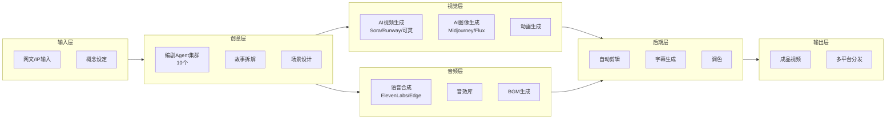

# OpenClaw 智能体应用研究（五）：短剧/真人短剧工业化改编

> **摘要**：本文系统阐述如何利用 OpenClaw 智能体框架构建短剧工业化生产流水线。通过 100+ 专业 Agent 组成的虚拟影视工作室，实现从剧本拆解、分镜设计、视频生成、配音配乐到剪辑分发的全流程自动化。该方案可将传统需要数十人团队、数月周期的短剧制作压缩至数天完成，是影视内容创作领域的颠覆性方案。

---

## 1. 引言

### 1.1 行业背景

短剧市场爆发式增长：
- 2025 年市场规模超 500 亿
- 年产量超 3 万部
- 单部爆款分账可达千万

**传统制作痛点**：
- 制作周期长：30-60 天/部
- 成本高昂：20-50 万/部
- 人才依赖强：需要编剧、导演、演员、后期
- 成功率低：90% 以上亏本

### 1.2 OpenClaw 解决方案

OpenClaw 的多 Agent 架构可以组建完整的虚拟影视工作室：



---

## 2. 系统架构

### 2.1 整体架构



### 2.2 Agent 分工

| 部门 | Agent 数量 | 核心职责 |
|------|-----------|----------|
| 编剧组 | 10 | 剧本拆解、对白生成、节奏把控 |
| 分镜组 | 15 | 视觉描述、构图设计、镜头语言 |
| 视频生成组 | 30 | AI 视频生成、人物动作、场景渲染 |
| 音频组 | 10 | 配音、音效、BGM |
| 剪辑组 | 20 | 拼接、转场、字幕、调色 |
| 发行组 | 5 | 多平台分发、数据分析 |

---

## 3. 剧本拆解与改编

### 3.1 编剧 Agent 配置

```json
{
  "name": "script-adapter",
  "description": "短剧剧本改编 Agent",
  "prompt": "你是一个专业短剧编剧。\n\n任务：将网文/IP 改编为短剧剧本。\n\n短剧规则：\n- 每集 1-2 分钟\n- 三秒一冲突，十秒一反转\n- 每集结尾留钩子\n- 总共 100 集\n\n输入：网文原文\n\n输出格式：\n{\n  \"total_episodes\": 100,\n  \"episodes\": [\n    {\n      \"number\": 1,\n      \"title\": \"重生归来\",\n      \"duration\": 90,\n      \"scenes\": [\n        {\n          \"id\": 1,\n          \"location\": \"医院病房\",\n          \"characters\": [\"男主\", \"医生\"],\n          \"dialogue\": \"你醒了？你已经昏迷三天了。\",\n          \"action\": \"男主缓缓睁眼，眼神锐利\",\n          \"emotional_beat\": \"震惊、觉醒\"\n        }\n      ],\n      \"cliffhanger\": \"门口突然传来脚步声...\"\n    }\n  ]\n}"
}
```

### 3.2 剧本拆解脚本

```python
# script_processor.py
import re

class ScriptProcessor:
    def __init__(self):
        self.episode_length = 90  # 秒
        self.scene_per_episode = 8  # 每集 8 个场景
    
    def parse_novel(self, novel_text):
        """解析网文，提取章节和情节"""
        chapters = re.split(r'第[零一二三四五六七八九十]+章', novel_text)
        return [c.strip() for c in chapters if c.strip()]
    
    def extract_plot_points(self, chapter):
        """提取关键情节节点"""
        # 使用 NLP 提取情节节点
        plot_points = []
        sentences = re.split(r'[。！？]', chapter)
        
        for sent in sentences:
            # 识别冲突、转折、高潮
            if any(kw in sent for kw in ['突然', '竟然', '没想到', '原来']):
                plot_points.append({
                    'type': '转折',
                    'content': sent
                })
            elif any(kw in sent for kw in ['怒', '恨', '不甘', '誓']):
                plot_points.append({
                    'type': '情感爆发',
                    'content': sent
                })
        
        return plot_points
    
    def generate_script(self, novel_text):
        """生成完整短剧剧本"""
        chapters = self.parse_novel(novel_text)
        script = {
            'title': self.extract_title(novel_text),
            'episodes': []
        }
        
        # 每章改编为 2-3 集
        episode_num = 1
        for chapter in chapters[:40]:  # 最多 100 集
            plot_points = self.extract_plot_points(chapter)
            
            for i in range(0, len(plot_points), self.scene_per_episode):
                episode_scenes = plot_points[i:i+self.scene_per_episode]
                if not episode_scenes:
                    continue
                
                episode = self.create_episode(episode_num, episode_scenes)
                script['episodes'].append(episode)
                episode_num += 1
                
                if episode_num > 100:
                    break
            
            if episode_num > 100:
                break
        
        return script
    
    def create_episode(self, number, scenes):
        """创建单集剧本"""
        return {
            'number': number,
            'title': f'第{number}集',
            'duration': self.episode_length,
            'scenes': [self.scene_to_dict(i, s) for i, s in enumerate(scenes)],
            'cliffhanger': self.generate_cliffhanger(scenes[-1] if scenes else '')
        }
    
    def scene_to_dict(self, index, plot_point):
        """将情节节点转换为场景描述"""
        return {
            'id': index,
            'location': self.infer_location(plot_point['content']),
            'characters': self.extract_characters(plot_point['content']),
            'dialogue': self.generate_dialogue(plot_point['content']),
            'action': self.generate_action(plot_point['content']),
            'emotional_beat': self.detect_emotion(plot_point['content'])
        }
```

---

## 4. 视频生成流水线

### 4.1 分镜 Agent

```json
{
  "name": "storyboard-artist",
  "description": "分镜设计 Agent",
  "prompt": "你是一个专业分镜师。\n\n任务：将剧本场景转化为视频生成提示词。\n\n输入场景：\n{\n  \"location\": \"医院病房\",\n  \"characters\": [\"男主\", \"医生\"],\n  \"action\": \"男主缓缓睁眼，眼神锐利\",\n  \"emotional_beat\": \"震惊、觉醒\"\n}\n\n输出：3 个镜头描述\n\n镜头 1 - 中景：\n提示词：cinematic shot, hospital room, patient waking up, dramatic lighting, 4k, photorealistic\n\n镜头 2 - 特写：\n提示词：close-up, man's eyes opening, sharp focus, determination in eyes, 8k\n\n镜头 3 - 过肩：\n提示词：over-the-shoulder shot, doctor looking at patient, concerned expression, depth of field"
}
```

### 4.2 AI 视频生成器

```python
# video_generator.py
import requests
import base64
import time

class VideoGenerator:
    def __init__(self, provider='runway'):
        self.provider = provider
        self.api_keys = {
            'runway': 'your-runway-key',
            'kling': 'your-kling-key',
            'sora': 'your-sora-key'
        }
    
    def generate_from_prompt(self, prompt, duration=5):
        """根据提示词生成视频片段"""
        if self.provider == 'runway':
            return self.runway_generate(prompt, duration)
        elif self.provider == 'kling':
            return self.kling_generate(prompt, duration)
        elif self.provider == 'sora':
            return self.sora_generate(prompt, duration)
    
    def runway_generate(self, prompt, duration):
        """调用 Runway Gen-3 API"""
        url = "https://api.runwayml.com/v1/generate"
        headers = {
            "Authorization": f"Bearer {self.api_keys['runway']}",
            "Content-Type": "application/json"
        }
        payload = {
            "prompt": prompt,
            "duration": duration,
            "resolution": "1080p",
            "style": "cinematic"
        }
        
        response = requests.post(url, json=payload, headers=headers)
        task_id = response.json()['task_id']
        
        # 轮询结果
        while True:
            status = requests.get(f"{url}/{task_id}", headers=headers)
            if status.json()['status'] == 'completed':
                return status.json()['video_url']
            time.sleep(10)
    
    def kling_generate(self, prompt, duration):
        """调用可灵 AI API"""
        # 可灵 API 调用
        url = "https://api.klingai.com/v1/videos/generations"
        headers = {
            "Authorization": f"Bearer {self.api_keys['kling']}"
        }
        payload = {
            "model_name": "kling-v1-5",
            "prompt": prompt,
            "duration": duration,
            "mode": "pro"
        }
        
        response = requests.post(url, json=payload, headers=headers)
        return response.json()
    
    def batch_generate(self, prompts):
        """批量生成视频片段"""
        results = []
        for i, prompt in enumerate(prompts):
            print(f"生成视频 {i+1}/{len(prompts)}: {prompt[:50]}...")
            video_url = self.generate_from_prompt(prompt)
            results.append({
                'index': i,
                'prompt': prompt,
                'url': video_url
            })
        return results
```

### 4.3 人物一致性保持

```python
# character_consistency.py
class CharacterManager:
    def __init__(self):
        self.characters = {}
    
    def register_character(self, name, reference_image):
        """注册角色，保存参考图"""
        self.characters[name] = {
            'name': name,
            'reference': reference_image,
            'description': self.extract_character_desc(reference_image)
        }
    
    def generate_character_prompt(self, character_name, action, emotion):
        """生成包含角色一致性的提示词"""
        char = self.characters.get(character_name)
        if not char:
            return f"{action}, {emotion}"
        
        # 使用 IP-Adapter 或角色 Lora 保持一致性
        prompt = f"{char['description']}, {action}, {emotion}, same character as reference"
        return prompt
    
    def extract_character_desc(self, image):
        """从参考图提取角色特征"""
        # 调用视觉模型提取特征
        return "young Chinese man, black hair, sharp eyes, determined expression"
```

---

## 5. 音频生成与合成

### 5.1 配音 Agent

```json
{
  "name": "voice-actor",
  "description": "AI 配音 Agent",
  "tools": ["tts"],
  "prompt": "你是一个专业配音导演。\n\n任务：为角色生成配音。\n\n角色设定：\n- 男主：沉稳、霸气的年轻男声\n- 女主：温柔但坚定的女声\n- 反派：阴险的中年男声\n\n输入：对白文本 + 角色 + 情感标签\n\n输出：调用 TTS 工具生成音频文件"
}
```

### 5.2 音效与 BGM 生成

```python
# audio_generator.py
import subprocess

class AudioGenerator:
    def __init__(self):
        self.tts_voices = {
            'male_deep': 'zh-CN-YunxiNeural',
            'female_warm': 'zh-CN-XiaoxiaoNeural',
            'villain': 'zh-CN-YunyangNeural'
        }
    
    def generate_voice(self, text, character, emotion):
        """生成角色配音"""
        voice = self.tts_voices.get(character, 'zh-CN-XiaoxiaoNeural')
        
        # 使用 OpenClaw TTS
        result = tts({
            'text': text,
            'channel': 'telegram'  # 输出格式
        })
        
        # 或使用 Edge TTS
        cmd = f'edge-tts --voice "{voice}" --text "{text}" --write-media output.wav'
        subprocess.run(cmd, shell=True)
        
        return 'output.wav'
    
    def generate_bgm(self, mood, duration):
        """根据情绪生成 BGM"""
        mood_map = {
            '紧张': 'fast_tempo, strings, suspense',
            '浪漫': 'piano, soft, romantic',
            '热血': 'epic, orchestral, uplifting',
            '悲伤': 'slow, piano, melancholic'
        }
        
        prompt = mood_map.get(mood, 'neutral background music')
        # 调用音乐生成 API
        # 如 Suno、AIVA 等
        return self.call_music_api(prompt, duration)
    
    def generate_sfx(self, sfx_type):
        """生成音效"""
        sfx_library = {
            '开门': 'door_open.wav',
            '脚步声': 'footsteps.wav',
            '心跳': 'heartbeat.wav',
            '爆炸': 'explosion.wav'
        }
        return sfx_library.get(sfx_type, 'default.wav')
```

---

## 6. 剪辑与合成

### 6.1 自动剪辑 Agent

```python
# video_editor.py
import subprocess
import json

class VideoEditor:
    def __init__(self):
        self.ffmpeg_path = 'ffmpeg'
    
    def assemble_episode(self, video_clips, audio_tracks, subtitles, output_path):
        """合成单集短剧"""
        # 1. 拼接视频片段
        concat_list = self.create_concat_file(video_clips)
        
        # 2. 添加音频
        # 3. 添加字幕
        # 4. 添加转场效果
        
        cmd = [
            self.ffmpeg_path,
            '-f', 'concat', '-safe', '0', '-i', concat_list,
            '-i', audio_tracks['dialogue'],
            '-i', audio_tracks['bgm'],
            '-filter_complex',
            f'[1:a]adelay=1000|1000[a1];[2:a]volume=0.3[a2];[a1][a2]amix=inputs=2[a]',
            '-map', '0:v', '-map', '[a]',
            '-c:v', 'libx264', '-preset', 'fast',
            '-c:a', 'aac',
            '-vf', f"subtitles={subtitles}",
            output_path
        ]
        
        subprocess.run(' '.join(cmd), shell=True)
        return output_path
    
    def create_concat_file(self, clips):
        """创建 FFmpeg concat 文件"""
        concat_file = 'concat_list.txt'
        with open(concat_file, 'w') as f:
            for clip in clips:
                f.write(f"file '{clip}'\n")
        return concat_file
    
    def add_transition(self, clip1, clip2, transition_type='fade'):
        """添加转场效果"""
        output = 'transition_output.mp4'
        
        if transition_type == 'fade':
            cmd = f"""
            {self.ffmpeg_path} -i {clip1} -i {clip2} -filter_complex 
            "[0:v]fade=out:st=4:d=1:alpha=1[v0];[1:v]fade=in:st=0:d=1:alpha=1[v1];[v0][v1]overlay" 
            {output}
            """
        
        return output
```

### 6.2 字幕生成 Agent

```python
# subtitle_generator.py
import whisper

class SubtitleGenerator:
    def __init__(self):
        self.model = whisper.load_model("base")
    
    def transcribe_audio(self, audio_path):
        """语音转文字生成字幕"""
        result = self.model.transcribe(audio_path, language='zh')
        
        subtitles = []
        for segment in result['segments']:
            subtitles.append({
                'start': segment['start'],
                'end': segment['end'],
                'text': segment['text']
            })
        
        return subtitles
    
    def generate_srt(self, subtitles, output_path):
        """生成 SRT 字幕文件"""
        with open(output_path, 'w', encoding='utf-8') as f:
            for i, sub in enumerate(subtitles, 1):
                start = self.format_time(sub['start'])
                end = self.format_time(sub['end'])
                f.write(f"{i}\n{start} --> {end}\n{sub['text']}\n\n")
    
    def format_time(self, seconds):
        """格式化时间戳"""
        hours = int(seconds // 3600)
        minutes = int((seconds % 3600) // 60)
        secs = int(seconds % 60)
        millis = int((seconds % 1) * 1000)
        return f"{hours:02d}:{minutes:02d}:{secs:02d},{millis:03d}"
```

---

## 7. 完整流水线代码

```javascript
// short-drama-pipeline.js
const fs = require('fs');

async function runShortDramaPipeline() {
    console.log('🎬 启动短剧工业化流水线');
    
    // Phase 1: 剧本改编
    console.log('📖 Phase 1: 剧本改编');
    const novel = fs.readFileSync('./input/novel.txt', 'utf-8');
    const script = await callAgent('script-adapter', { novel });
    fs.writeFileSync('./output/script.json', JSON.stringify(script, null, 2));
    
    // Phase 2: 分镜设计
    console.log('🎨 Phase 2: 分镜设计');
    const storyboards = [];
    for (const episode of script.episodes.slice(0, 3)) { // 先试做 3 集
        for (const scene of episode.scenes) {
            const storyboard = await callAgent('storyboard-artist', { scene });
            storyboards.push(storyboard);
        }
    }
    
    // Phase 3: 视频生成
    console.log('🎥 Phase 3: 视频生成');
    const videoGenerator = new VideoGenerator('kling');
    const videoClips = [];
    
    for (const sb of storyboards) {
        for (const shot of sb.shots) {
            const videoUrl = await videoGenerator.generate_from_prompt(shot.prompt, 5);
            videoClips.push({ shot, url: videoUrl });
        }
    }
    
    // Phase 4: 音频生成
    console.log('🎵 Phase 4: 音频生成');
    const audioGen = new AudioGenerator();
    const audioTracks = [];
    
    for (const scene of script.episodes[0].scenes) {
        for (const line of scene.dialogue) {
            const audio = await audioGen.generate_voice(line.text, line.character, line.emotion);
            audioTracks.push(audio);
        }
    }
    
    // Phase 5: 剪辑合成
    console.log('✂️ Phase 5: 剪辑合成');
    const editor = new VideoEditor();
    const videoPaths = videoClips.map(v => v.url);
    const subtitles = await generateSubtitles(audioTracks);
    
    const finalVideo = await editor.assemble_episode(
        videoPaths,
        audioTracks,
        subtitles,
        './output/episode_01.mp4'
    );
    
    // Phase 6: 分发
    console.log('📤 Phase 6: 分发');
    await distributeToPlatforms(finalVideo, script.title);
    
    console.log('✅ 短剧制作完成！');
}

async function distributeToPlatforms(videoPath, title) {
    const platforms = ['douyin', 'kuaishou', 'youtube', 'reels'];
    
    for (const platform of platforms) {
        await callAgent('platform-publisher', {
            platform,
            video: videoPath,
            title,
            hashtags: ['短剧', 'AI制作', title]
        });
    }
}

// 执行
runShortDramaPipeline().catch(console.error);
```

---

## 8. 成本效益分析

### 8.1 传统制作 vs OpenClaw 模式

| 指标 | 传统短剧 | OpenClaw 模式 |
|------|----------|---------------|
| 制作团队 | 30-50 人 | 1 人 + 100 Agents |
| 制作周期 | 30-60 天 | 3-7 天 |
| 制作成本 | 20-50 万 | 5000-1 万元 |
| 日产量 | 0.5 部 | 10 部 |
| 质量一致性 | 波动大 | 稳定可控 |
| 可迭代性 | 差 | 可快速修改 |

### 8.2 ROI 测算

以月产 10 部短剧为例：

| 项目 | 传统模式 | OpenClaw 模式 |
|------|----------|---------------|
| 人力成本 | 80 万 | 0 |
| 设备、场地 | 10 万 | 0 |
| AI 视频成本 | 0 | 约 3 万 |
| TTS/音效 | 0 | 约 2000 |
| **月总成本** | **90 万** | **约 3.5 万** |
| **节省比例** | - | **96%** |

---

## 9. 总结与展望

### 9.1 核心优势

1. **效率革命**：从 60 天到 7 天，提速 8 倍
2. **成本优势**：成本降低 90%+
3. **无限迭代**：快速修改、A/B 测试
4. **多语言输出**：自动翻译，全球分发

### 9.2 适用场景

- ✅ 网文改编短剧
- ✅ 品牌定制短剧
- ✅ 知识科普短片
- ✅ 动漫/动画制作
- ✅ 广告宣传片

### 9.3 未来展望

- **实时互动**：观众选择影响剧情走向
- **虚拟演员**：创建可持续使用的数字人角色库
- **智能推荐**：根据数据自动优化剧本结构
- **跨模态创作**：文字 → 视频 → 游戏 一键转换

---

## 参考文献

1. Runway Gen-3 API 文档
2. 可灵 AI 视频生成技术白皮书
3. 《短剧工业化生产白皮书》2026

---

**附录：完整代码仓库**

所有脚本可在 workspace 目录下找到：
- `short-drama-pipeline.js` - 主流水线
- `script_processor.py` - 剧本处理
- `video_generator.py` - 视频生成
- `audio_generator.py` - 音频生成
- `video_editor.py` - 视频剪辑
