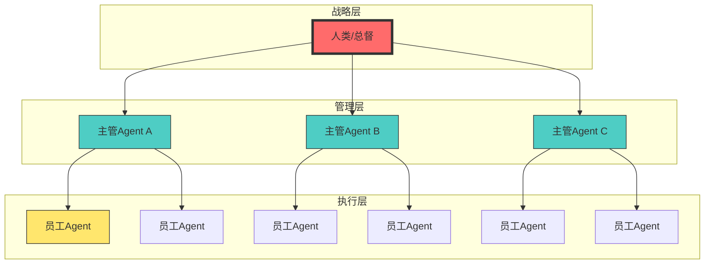
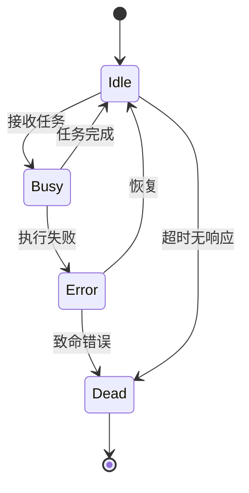

# OpenClaw 智能体应用研究（六）：科层制管理与 Agent 编排

> **摘要**：本文系统阐述 OpenClaw 智能体框架的核心组织哲学——科层制管理。通过建立“总督→主管→员工”三级金字塔架构，实现大规模 Agent 集群的高效协作。本文提供完整的 Agent 编排方案，包括任务拆解、层级通信、状态管理、异常处理等关键机制，是构建任何复杂自动化系统的底层方法论。

---

## 1. 引言

### 1.1 核心问题

当 Agent 数量从几个扩展到几十上百个时，简单的一对一调度将彻底失效：
- **管理瓶颈**：人类无法同时微操超过 5 个 Agent
- **通信爆炸**：N 个 Agent 之间需要 O(N²) 条通信链路
- **任务混乱**：缺乏层级导致任务重复或遗漏
- **状态失控**：无法追踪复杂任务的进度

### 1.2 科层制解决方案

借鉴现代企业管理学，OpenClaw 引入**三级科层制**：



**核心原则**：
- **层级控制**：上级对下级下达战略指令，不干预执行细节
- **职责明确**：每个 Agent 有唯一的职责范围
- **信息过滤**：底层只向上层汇报结果，不传递噪音
- **异常升级**：无法处理的问题逐级上报

---

## 2. 三级架构设计

### 2.1 总督（顶层）

**角色**：人类或主 Agent，负责下达最高维度战略指示。

**职责**：
- 接收用户需求
- 拆解为宏观战略目标
- 分配给主管 Agent
- 监督整体进度

**代码实现**：
```javascript
// 总督 Agent 模板
const GovernorAgent = {
    name: "governor",
    async execute(userRequest) {
        // 1. 理解用户意图
        const intent = await this.understandIntent(userRequest);
        
        // 2. 拆解为战略目标
        const strategies = await this.decompose(intent);
        
        // 3. 分配给各主管
        const results = [];
        for (const strategy of strategies) {
            const result = await this.delegateToManager(strategy);
            results.push(result);
        }
        
        // 4. 汇总结果
        return this.synthesize(results);
    },
    
    async delegateToManager(strategy) {
        // 通过 sessions_spawn 启动主管 Agent
        return await sessions_spawn({
            task: JSON.stringify(strategy),
            agentId: strategy.domain + "-manager",
            runtime: "subagent",
            wait: true,
            timeoutSeconds: 3600
        });
    }
};
```

### 2.2 主管 Agent（中层）

**角色**：领域专家，负责将战略拆解为可执行任务，管理员工 Agent。

**职责**：
- 接收战略指令
- 拆解为具体任务
- 调度员工 Agent
- 汇总结果，向上汇报
- 处理异常

**代码实现**：
```javascript
// 主管 Agent 模板
class ManagerAgent {
    constructor(domain, maxWorkers = 10) {
        this.domain = domain;
        this.maxWorkers = maxWorkers;
        this.workers = [];
        this.taskQueue = [];
        this.results = [];
    }
    
    async execute(strategy) {
        // 1. 拆解任务
        const tasks = await this.decomposeStrategy(strategy);
        
        // 2. 调度员工
        const results = await this.scheduleWorkers(tasks);
        
        // 3. 质量审核
        const validated = await this.validateResults(results);
        
        // 4. 汇总上报
        return this.summarize(validated);
    }
    
    async decomposeStrategy(strategy) {
        // 使用大模型将战略拆解为具体任务
        const prompt = `
        战略目标：${strategy.description}
        
        请将此战略拆解为 ${this.maxWorkers} 个以内的具体任务，
        每个任务包含：
        - 任务描述
        - 预期产出
        - 预估工作量
        - 依赖关系
        
        输出 JSON 数组。
        `;
        
        const response = await this.callLLM(prompt);
        return JSON.parse(response);
    }
    
    async scheduleWorkers(tasks) {
        // 并行调度员工
        const workerPromises = tasks.map(task => 
            this.assignWorker(task).catch(err => ({
                taskId: task.id,
                status: 'failed',
                error: err.message
            }))
        );
        
        return await Promise.all(workerPromises);
    }
    
    async assignWorker(task) {
        // 找到空闲员工或创建新员工
        let worker = this.workers.find(w => w.status === 'idle');
        
        if (!worker && this.workers.length < this.maxWorkers) {
            worker = await this.createWorker();
            this.workers.push(worker);
        }
        
        if (!worker) {
            // 加入队列
            this.taskQueue.push(task);
            return { taskId: task.id, status: 'queued' };
        }
        
        // 分配任务
        worker.status = 'busy';
        const result = await worker.execute(task);
        worker.status = 'idle';
        
        // 处理队列中的下一个任务
        if (this.taskQueue.length > 0) {
            const nextTask = this.taskQueue.shift();
            this.assignWorker(nextTask);
        }
        
        return result;
    }
    
    async createWorker() {
        // 通过 sessions_spawn 创建员工 Agent
        const workerId = await sessions_spawn({
            task: "初始化员工 Agent，等待任务分配",
            agentId: this.domain + "-worker",
            runtime: "subagent",
            mode: "session",  // 持久会话，等待任务
            wait: false
        });
        
        return {
            id: workerId,
            status: 'idle',
            async execute(task) {
                // 向员工 Agent 发送任务
                const result = await sessions_send({
                    sessionKey: workerId,
                    message: JSON.stringify(task)
                });
                return JSON.parse(result);
            }
        };
    }
}
```

### 2.3 员工 Agent（底层）

**角色**：执行具体任务的原子单元。

**职责**：
- 接收具体任务
- 执行任务
- 返回结果
- 遇到问题向上报告

**代码实现**：
```javascript
// 员工 Agent 模板
const WorkerAgent = {
    name: "generic-worker",
    
    async execute(task) {
        try {
            // 1. 解析任务
            const parsedTask = this.parseTask(task);
            
            // 2. 准备工具
            const tools = this.selectTools(parsedTask);
            
            // 3. 执行任务
            const result = await this.performTask(parsedTask, tools);
            
            // 4. 验证结果
            const validated = await this.validateResult(result, parsedTask);
            
            return {
                status: 'success',
                result: validated,
                taskId: task.id
            };
            
        } catch (error) {
            // 异常升级
            return {
                status: 'failed',
                error: error.message,
                taskId: task.id,
                escalation: this.shouldEscalate(error)
            };
        }
    },
    
    shouldEscalate(error) {
        // 判断是否需要向上级报告
        const criticalErrors = ['permission', 'api_key', 'timeout', 'resource'];
        return criticalErrors.some(e => error.message.includes(e));
    }
};
```

---

## 3. 通信与协作机制

### 3.1 层级通信协议

```javascript
// 通信协议定义
const MessageTypes = {
    // 下行命令
    COMMAND: 'command',           // 上级 → 下级
    QUERY: 'query',               // 上级查询下级状态
    ESCALATE: 'escalate',         // 下级向上级报告问题
    
    // 上行报告
    RESULT: 'result',             // 下级返回结果
    STATUS: 'status',             // 状态报告
    ERROR: 'error',               // 错误报告
    
    // 同级通信
    SYNC: 'sync',                 // 同级同步信息
    REQUEST: 'request'            // 同级请求协作
};

class MessageBus {
    constructor() {
        this.channels = new Map();
    }
    
    async send(from, to, type, payload) {
        const message = {
            id: this.generateId(),
            from,
            to,
            type,
            payload,
            timestamp: Date.now()
        };
        
        // 记录通信日志
        await this.logMessage(message);
        
        // 发送消息
        if (to === 'manager') {
            await this.sendToManager(message);
        } else if (to === 'governor') {
            await this.sendToGovernor(message);
        } else {
            await this.sendToAgent(to, message);
        }
        
        return message.id;
    }
    
    async logMessage(message) {
        // 写入通信日志，用于调试和审计
        const log = {
            ...message,
            receivedAt: Date.now()
        };
        await write(`./logs/communication/${message.id}.json`, JSON.stringify(log));
    }
}
```

### 3.2 任务传递机制

```javascript
// 任务传递与状态追踪
class TaskOrchestrator {
    constructor() {
        this.tasks = new Map();
        this.dependencies = new Map();
    }
    
    async createTask(description, parentTaskId = null) {
        const task = {
            id: this.generateId(),
            description,
            status: 'created',
            parentId: parentTaskId,
            subTasks: [],
            result: null,
            createdAt: Date.now()
        };
        
        this.tasks.set(task.id, task);
        
        if (parentTaskId) {
            const parent = this.tasks.get(parentTaskId);
            parent.subTasks.push(task.id);
        }
        
        return task.id;
    }
    
    async updateTask(taskId, update) {
        const task = this.tasks.get(taskId);
        Object.assign(task, update);
        task.updatedAt = Date.now();
        
        // 如果任务完成，检查父任务
        if (update.status === 'done') {
            await this.checkParentCompletion(task.parentId);
        }
        
        return task;
    }
    
    async checkParentCompletion(parentId) {
        if (!parentId) return;
        
        const parent = this.tasks.get(parentId);
        const allDone = parent.subTasks.every(subId => {
            const sub = this.tasks.get(subId);
            return sub.status === 'done' || sub.status === 'skipped';
        });
        
        if (allDone && parent.status !== 'done') {
            await this.updateTask(parentId, { status: 'done' });
        }
    }
    
    async getTaskTree(taskId) {
        const task = this.tasks.get(taskId);
        if (!task) return null;
        
        return {
            ...task,
            subTasks: await Promise.all(
                task.subTasks.map(id => this.getTaskTree(id))
            )
        };
    }
}
```

---

## 4. 状态管理与监控

### 4.1 Agent 状态机



**代码实现**：
```javascript
// Agent 状态机
class AgentStateMachine {
    constructor(agentId) {
        this.agentId = agentId;
        this.state = 'idle';
        this.currentTask = null;
        this.errorCount = 0;
        this.lastHeartbeat = Date.now();
    }
    
    async transition(newState, context = {}) {
        const oldState = this.state;
        
        // 状态转换验证
        const validTransitions = {
            idle: ['busy', 'dead'],
            busy: ['idle', 'error'],
            error: ['idle', 'dead']
        };
        
        if (!validTransitions[oldState]?.includes(newState)) {
            throw new Error(`Invalid transition: ${oldState} -> ${newState}`);
        }
        
        // 执行状态转换
        this.state = newState;
        
        // 记录状态变更
        await this.logStateChange(oldState, newState, context);
        
        // 触发回调
        this.onStateChange?.(oldState, newState, context);
        
        return this.state;
    }
    
    async logStateChange(oldState, newState, context) {
        const log = {
            agentId: this.agentId,
            timestamp: Date.now(),
            from: oldState,
            to: newState,
            taskId: this.currentTask?.id,
            context
        };
        await write(`./logs/agents/${this.agentId}/state.json`, JSON.stringify(log, null, 2));
    }
    
    heartbeat() {
        this.lastHeartbeat = Date.now();
        
        // 检查超时
        if (this.state === 'busy' && Date.now() - this.lastHeartbeat > 60000) {
            this.transition('error', { reason: 'heartbeat timeout' });
        }
    }
}
```

### 4.2 全局监控面板

```javascript
// 监控系统
class MonitoringSystem {
    constructor() {
        this.agents = new Map();
        this.metrics = {
            totalTasks: 0,
            completedTasks: 0,
            failedTasks: 0,
            avgTaskDuration: 0
        };
    }
    
    registerAgent(agentId, type, parentId = null) {
        this.agents.set(agentId, {
            id: agentId,
            type,
            parentId,
            state: 'idle',
            tasks: [],
            createdAt: Date.now(),
            lastActive: Date.now()
        });
    }
    
    updateAgent(agentId, update) {
        const agent = this.agents.get(agentId);
        if (agent) {
            Object.assign(agent, update);
            agent.lastActive = Date.now();
        }
    }
    
    recordTask(agentId, task) {
        const agent = this.agents.get(agentId);
        if (agent) {
            agent.tasks.push({
                ...task,
                startTime: Date.now()
            });
            this.metrics.totalTasks++;
        }
    }
    
    generateReport() {
        const activeAgents = Array.from(this.agents.values())
            .filter(a => a.state !== 'dead');
        
        const busyAgents = activeAgents.filter(a => a.state === 'busy');
        const idleAgents = activeAgents.filter(a => a.state === 'idle');
        const errorAgents = activeAgents.filter(a => a.state === 'error');
        
        return {
            summary: {
                total: activeAgents.length,
                busy: busyAgents.length,
                idle: idleAgents.length,
                error: errorAgents.length,
                ...this.metrics
            },
            hierarchy: this.buildHierarchy(),
            recentTasks: this.getRecentTasks(20),
            performance: this.calculatePerformance()
        };
    }
    
    buildHierarchy() {
        const root = Array.from(this.agents.values())
            .find(a => a.parentId === null);
        
        if (!root) return null;
        
        const buildNode = (agent) => ({
            ...agent,
            children: Array.from(this.agents.values())
                .filter(a => a.parentId === agent.id)
                .map(buildNode)
        });
        
        return buildNode(root);
    }
}
```

---

## 5. 异常处理与自愈机制

### 5.1 异常分类与处理

```javascript
// 异常处理系统
class ExceptionHandler {
    constructor() {
        this.handlers = new Map();
        this.registerDefaultHandlers();
    }
    
    registerDefaultHandlers() {
        // 网络异常：重试
        this.handlers.set('network_error', async (error, context) => {
            const maxRetries = 3;
            let retries = 0;
            
            while (retries < maxRetries) {
                try {
                    await this.retry(context);
                    return { handled: true, action: 'retry_success' };
                } catch (e) {
                    retries++;
                    await this.sleep(1000 * Math.pow(2, retries)); // 指数退避
                }
            }
            
            return { handled: false, action: 'escalate' };
        });
        
        // API 限流：等待
        this.handlers.set('rate_limit', async (error, context) => {
            const waitTime = error.retryAfter || 60000;
            await this.sleep(waitTime);
            return { handled: true, action: 'retry' };
        });
        
        // 资源不足：释放资源
        this.handlers.set('resource_exhausted', async (error, context) => {
            await this.releaseResources(context);
            return { handled: true, action: 'retry' };
        });
        
        // 任务超时：终止并上报
        this.handlers.set('timeout', async (error, context) => {
            await this.killTask(context.taskId);
            return { handled: false, action: 'escalate', reason: 'task_timeout' };
        });
    }
    
    async handle(error, context) {
        const errorType = this.classifyError(error);
        const handler = this.handlers.get(errorType);
        
        if (handler) {
            return await handler(error, context);
        }
        
        // 未知错误，升级
        return { handled: false, action: 'escalate', error: error.message };
    }
    
    classifyError(error) {
        if (error.message.includes('network') || error.code === 'ECONNREFUSED') {
            return 'network_error';
        }
        if (error.message.includes('rate limit') || error.status === 429) {
            return 'rate_limit';
        }
        if (error.message.includes('timeout')) {
            return 'timeout';
        }
        if (error.message.includes('resource')) {
            return 'resource_exhausted';
        }
        return 'unknown';
    }
}
```

### 5.2 自愈机制

```javascript
// 自愈系统
class SelfHealingSystem {
    constructor() {
        this.healthChecks = new Map();
        this.recoveryStrategies = new Map();
    }
    
    registerHealthCheck(agentType, checkFunction) {
        this.healthChecks.set(agentType, checkFunction);
    }
    
    registerRecovery(agentType, recoveryFunction) {
        this.recoveryStrategies.set(agentType, recoveryFunction);
    }
    
    async healthCheck() {
        const results = [];
        
        for (const [type, check] of this.healthChecks) {
            const result = await check();
            results.push({ type, ...result });
            
            if (!result.healthy) {
                await this.recover(type, result);
            }
        }
        
        return results;
    }
    
    async recover(agentType, healthResult) {
        const strategy = this.recoveryStrategies.get(agentType);
        if (strategy) {
            console.log(`自愈：尝试恢复 ${agentType} Agent`);
            await strategy(healthResult);
        }
    }
}

// 预置恢复策略
const defaultRecovery = {
    // Agent 无响应：重启
    unresponsive: async (agent) => {
        await sessions_send({
            sessionKey: agent.id,
            message: "RESTART"
        });
        
        // 等待 5 秒
        await new Promise(resolve => setTimeout(resolve, 5000));
        
        // 检查是否恢复
        const status = await sessions_status({ sessionKey: agent.id });
        if (!status.active) {
            // 重新创建
            await sessions_spawn({
                task: agent.originalTask,
                agentId: agent.type,
                runtime: "subagent"
            });
        }
    },
    
    // 内存不足：清理缓存
    memory_pressure: async (agent) => {
        await sessions_send({
            sessionKey: agent.id,
            message: "CLEAR_CACHE"
        });
    },
    
    // API 密钥失效：通知人类
    auth_failure: async (agent) => {
        await message({
            action: 'send',
            channel: 'telegram',
            target: process.env.ADMIN_CHANNEL,
            message: `⚠️ ${agent.type} Agent 认证失败，请更新 API 密钥`
        });
    }
};
```

---

## 6. 完整编排示例

### 6.1 小说创作工厂

```javascript
// novel-factory.js - 科层制完整示例
async function runNovelFactory() {
    // 总督：接收需求
    const governor = new GovernorAgent();
    
    const result = await governor.execute({
        type: 'novel',
        genre: '修仙',
        length: '1_000_000',
        target: 'webnovel'
    });
    
    console.log('小说创作完成！');
    console.log(`总字数: ${result.totalWords}`);
    console.log(`耗时: ${result.duration} 分钟`);
    console.log(`质量评分: ${result.qualityScore}`);
}

// 主管 Agent：策划总监
class PlanningManager extends ManagerAgent {
    async decomposeStrategy(strategy) {
        return [
            { id: 'worldview', desc: '构建世界观和力量体系', priority: 1 },
            { id: 'characters', desc: '设计主要角色', priority: 2 },
            { id: 'outline', desc: '撰写 100 章大纲', priority: 3 },
            { id: 'chapters', desc: '分章扩写', priority: 4, depends: ['outline'] },
            { id: 'polish', desc: '润色和校对', priority: 5, depends: ['chapters'] }
        ];
    }
}

// 员工 Agent：章节扩写员
class ChapterWriter extends WorkerAgent {
    async performTask(task) {
        const prompt = `
        根据以下大纲扩写第 ${task.chapterNumber} 章：
        ${task.outline}
        
        要求：
        - 字数 3000-5000 字
        - 包含环境描写、对话、心理活动
        - 结尾留钩子
        `;
        
        const response = await this.callLLM(prompt);
        return {
            chapter: task.chapterNumber,
            content: response,
            wordCount: this.countWords(response)
        };
    }
}
```

### 6.2 科层制配置模板

```json
{
  "hierarchy": {
    "governor": {
      "agentId": "novel-governor",
      "description": "小说创作总督"
    },
    "managers": [
      {
        "agentId": "planning-manager",
        "description": "策划总监",
        "workers": ["worldview-writer", "character-designer", "outline-writer"],
        "maxWorkers": 5
      },
      {
        "agentId": "writing-manager",
        "description": "写作总监",
        "workers": ["chapter-writer"],
        "maxWorkers": 20
      },
      {
        "agentId": "polish-manager",
        "description": "润色总监",
        "workers": ["grammar-checker", "style-enhancer"],
        "maxWorkers": 10
      }
    ]
  },
  "communication": {
    "protocol": "message-bus",
    "timeout": 30000,
    "retry": 3
  },
  "monitoring": {
    "enabled": true,
    "reportInterval": 60000,
    "alertChannel": "telegram/123456789"
  }
}
```

---

## 7. 总结与最佳实践

### 7.1 核心原则

| 原则 | 说明 |
|------|------|
| **不要微操** | 只对主管下达战略指令，不干预执行细节 |
| **职责单一** | 每个 Agent 只做一件事，做精做强 |
| **信息过滤** | 底层只上报结果，不传递噪音 |
| **异常升级** | 无法处理的问题自动上报 |
| **状态可见** | 所有层级状态可追踪、可审计 |

### 7.2 设计检查清单

- [ ] 是否定义了清晰的三级架构？
- [ ] 主管 Agent 能否独立拆解战略？
- [ ] 员工 Agent 是否职责单一？
- [ ] 通信协议是否完整？
- [ ] 异常处理是否完善？
- [ ] 监控系统是否就绪？
- [ ] 是否支持水平扩展？

### 7.3 常见陷阱

1. **过度扁平化**：所有 Agent 直接受人类管理 → 人类成为瓶颈
2. **层级过多**：5 层以上 → 通信延迟大，效率低下
3. **职责重叠**：多个 Agent 做同一件事 → 资源浪费，结果冲突
4. **缺乏监控**：不知道 Agent 在做什么 → 无法调试优化
5. **忽略异常**：Agent 失败无人处理 → 任务停滞

### 7.4 扩展建议

- **动态扩缩容**：根据任务量自动增减员工 Agent
- **智能调度**：根据 Agent 历史表现分配任务
- **持续学习**：从历史数据中优化任务拆解策略
- **跨域协作**：不同领域主管 Agent 之间的协作机制

---

## 参考文献

1. OpenClaw 多 Agent 编排文档
2. 《企业级 Agent 架构设计》2026
3. 分布式系统设计模式

---

**附录：完整代码仓库**

所有脚本可在 workspace 目录下找到：
- `governor-agent.js` - 总督 Agent
- `manager-agent.js` - 主管 Agent
- `worker-agent.js` - 员工 Agent
- `message-bus.js` - 通信总线
- `monitoring-system.js` - 监控系统
- `exception-handler.js` - 异常处理
